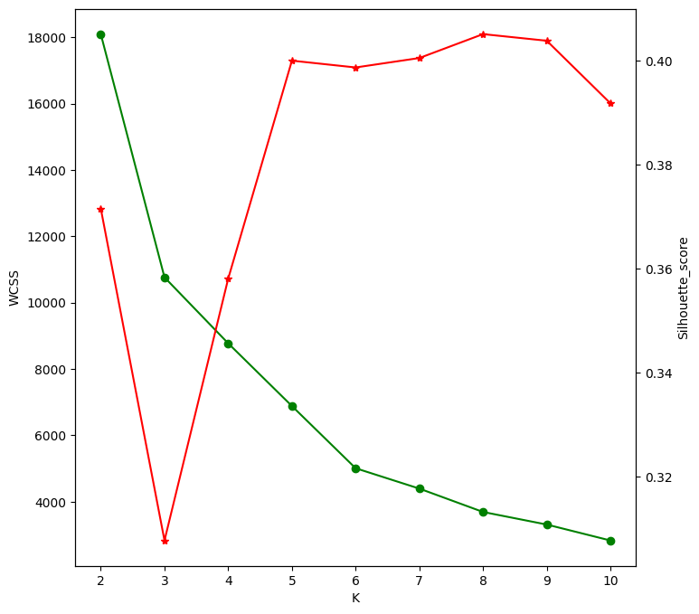
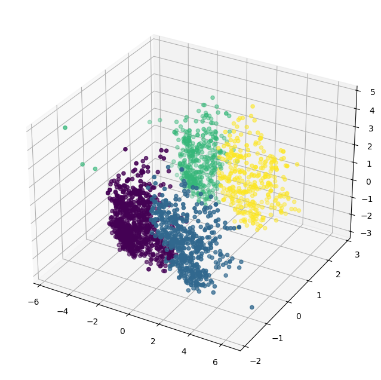
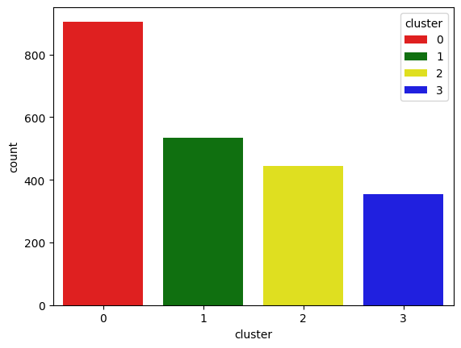

# SmartCart-Customer-Segmentation
**SmartCart Customer Segmentation System**
**Overview**
An intelligent customer segmentation system built using unsupervised machine learning to identify meaningful customer groups based on purchasing behavior, engagement level, and loyalty indicators.

**Problem Statement**

SmartCart applies generic marketing strategies to all customers, resulting in inefficient marketing spend and missed retention opportunities.
This project builds a clustering-based segmentation system to enable data-driven personalization and targeted marketing.

**Dataset**

2,240 customer records

22 attributes

Demographics, spending behavior, purchase frequency, website activity, and customer response

**Methodology**
1. Data Preprocessing

Data cleaning and handling missing values

Feature engineering (Age, Total Spending, Total Purchases, Customer Tenure, etc.)

Feature scaling using StandardScaler

2. Clustering Algorithms Evaluated

K-Means

Agglomerative Clustering

DBSCAN

3. Model Selection

Elbow Method

Silhouette Score

Cluster interpretability

After evaluation, Agglomerative Clustering produced the most meaningful and well-separated customer groups.

Final Model: 4 Customer Segments

**Customer Segments Identified**

C0 – Family Budget Shoppers

C1 – Moderate Loyal Customers

C2 – Digitally Active Individuals

C3 – High-Value Premium Customers

**Business Decisions**

After segmenting customers into 4 groups, SmartCart can stop treating all customers the same and start making smarter marketing decisions.

1. C3 – High-Value Premium Customers

Who they are:
High income, high spending, strong campaign response.

Business Decision:
Focus on retaining them because they generate the most revenue.

Example:

Offer VIP membership
Give early access to new products
Provide exclusive discounts

If 10% of customers generate 40% of revenue, keeping them loyal directly increases profit.

2. C0 – Family Budget Shoppers

Who they are:
More children, price-sensitive, buy on discounts.

Business Decision:
Use bundle offers and discount campaigns.

Example:

“Buy 2 Get 1 Free”
Family combo packs
Seasonal discount promotions

This increases purchase frequency without wasting money on premium marketing.

3. C2 – Digitally Active Customers

Who they are:
High website visits, moderate spending.

Business Decision:
Convert visits into purchases using digital marketing.

Example:

App notifications
Personalized product recommendations
Limited-time online offers

Since they already browse frequently, targeted nudges can increase sales.

4. C1 – Moderate Loyal Customers

Who they are:
Balanced spending and engagement.

Business Decision:
Strengthen loyalty and encourage higher spending.

Example:

Reward points program
Cross-selling related products
“Spend more, earn more” campaigns

Overall Business Benefit

Instead of spending marketing money equally on all customers:

i. Invest more in high-value customers (C3)
ii. Use discounts strategically for families (C0)
iii. Push digital engagement for active users (C2)
iv. Build loyalty for steady customers (C1)

This leads to Higher customer retention and Increased lifetime value

**Tech Stack**

Python

Pandas

NumPy

Scikit-learn

Matplotlib / Seaborn

Jupyter Notebook

**How to Run**

Clone the repository

Install dependencies from requirements.txt

Run the notebook

Commit and push this updated README.
